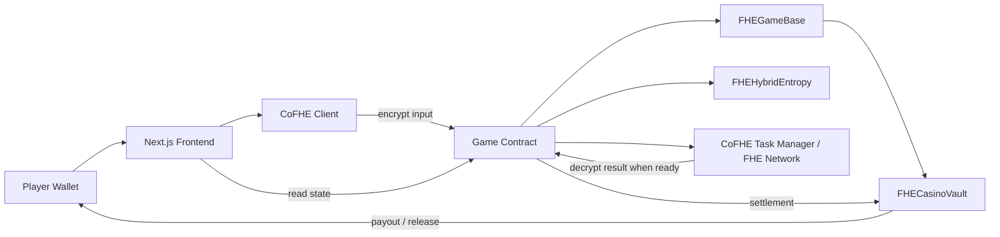
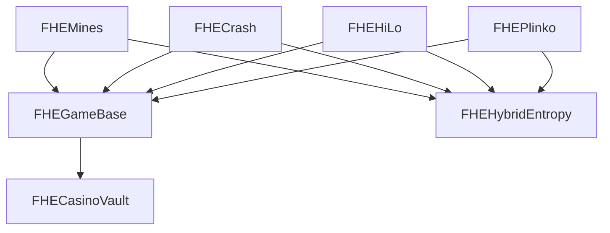
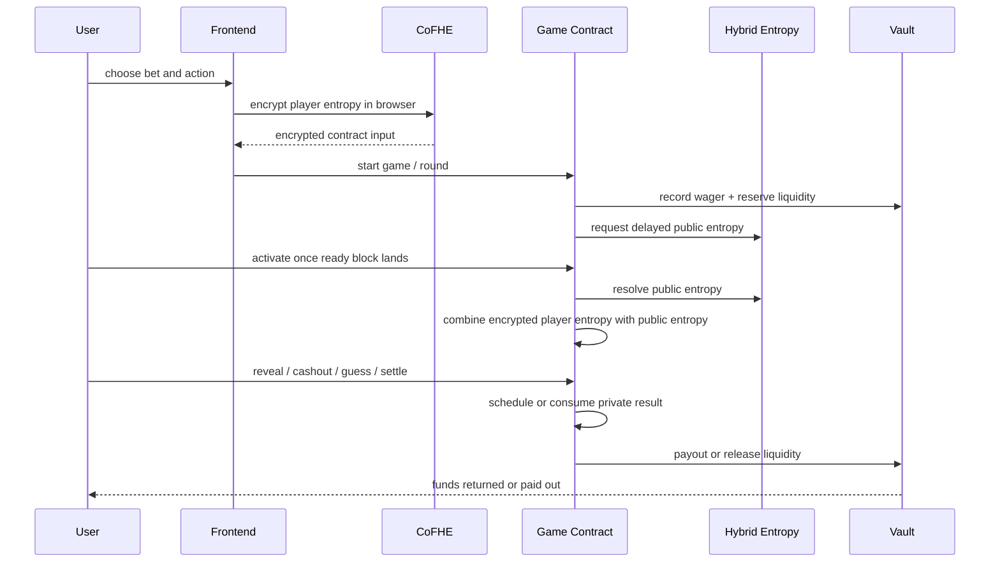
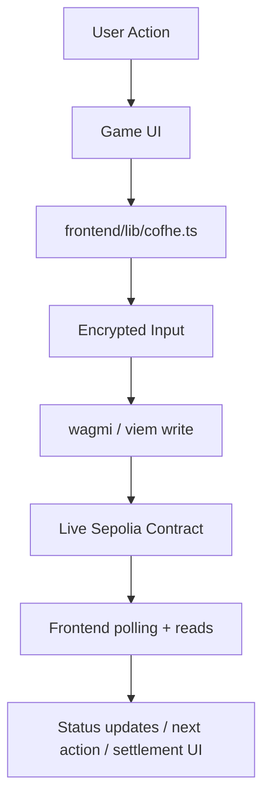

# FHE Casino

Privacy-native casino protocol built on Fhenix and CoFHE.

This repo contains a live Wave 1 MVP with:

- 4 encrypted games: Mines, Crash, HiLo, Plinko
- shared vault and session infrastructure
- browser-side encrypted inputs with CoFHE
- Sepolia deployment for public buildathon demos
- a Next.js frontend ready for localhost and Vercel

The project is being built as a player-facing protocol, not just a hackathon demo. Wave 1 proves the core thesis: hidden game state can stay encrypted while gameplay and settlement remain verifiable on-chain.

## What Is Live Now

Wave 1 currently ships:

- `FHEMines` - encrypted 5x5 grid with hidden mine locations
- `FHECrash` - sealed crash point and private cashout checks
- `FHEHiLo` - encrypted card progression and hidden outcomes
- `FHEPlinko` - encrypted path seed with visual replay on the frontend
- `FHECasinoVault` - shared bankroll, reservation, payout, and fee accounting
- Next.js 14 frontend with wallet connection, game routes, and landing page

## Why This Exists

Transparent rails are a bad fit for hidden-information games. If card state, mine positions, or crash outcomes are visible before reveal, the game is broken. FHE Casino uses encrypted smart contract state so game-critical data stays sealed until the correct reveal step.

This makes the system:

- privacy-preserving - sensitive game state stays encrypted during computation
- programmable - game rules still execute in smart contracts
- verifiable - bankroll accounting, settlement, and permissions remain on-chain
- extensible - the same architecture can expand into multiplayer and tournament formats

## Architecture

### High-Level System



### Contract Topology



### Gameplay Lifecycle



## Core Contracts

### Base Layer

| Contract | Purpose |
| --- | --- |
| `contracts/base/FHEGameBase.sol` | Shared session handling, bet limits, house edge, vault integration, task manager wiring, and encrypted constant helpers |
| `contracts/base/FHEHybridEntropy.sol` | Delayed public entropy source used on allowed public testnets |
| `contracts/base/FHEGameTypes.sol` | Common session structs and settlement enums |

### Vault Layer

| Contract | Purpose |
| --- | --- |
| `contracts/vault/FHECasinoVault.sol` | Bankroll custody, wager accounting, liquidity reservations, payouts, house fee tracking |
| `contracts/vault/IFHECasinoVault.sol` | Vault interface used by games |

### Game Layer

| Contract | Purpose |
| --- | --- |
| `contracts/games/FHEMines.sol` | Encrypted grid game with safe reveals and cashout |
| `contracts/games/FHECrash.sol` | Private crash multiplier and cashout logic |
| `contracts/games/FHEHiLo.sol` | Private card progression and higher/lower outcome resolution |
| `contracts/games/FHEPlinko.sol` | Encrypted drop path and slot-based payout logic |

## Frontend Architecture

The frontend lives in `frontend/` and is built with Next.js 14, React 18, wagmi, viem, RainbowKit, and CoFHE.

### Main Frontend Modules

| Path | Role |
| --- | --- |
| `frontend/components/landing/landing-page.tsx` | Player-facing landing page and roadmap |
| `frontend/components/lobby/game-lobby.tsx` | Main casino lobby |
| `frontend/components/casino/` | Individual game experiences and shared shell |
| `frontend/components/providers/app-providers.tsx` | wagmi / RainbowKit app providers |
| `frontend/lib/contracts.ts` | live contract addresses and ABIs used by the app |
| `frontend/lib/cofhe.ts` | browser encryption / decryption helpers and CoFHE retry handling |
| `frontend/lib/web3.ts` | chain config and wallet transport setup |

### Frontend Flow



## Games

| Game | Privacy Surface | Live Pattern | Max Payout Profile |
| --- | --- | --- | --- |
| Mines | mine positions, reveal outcome, cashout path | encrypted grid | up to ~24x |
| Crash | crash point, cashout permission, reveal | sealed multiplier | up to 1000x curve model |
| HiLo | current card, next outcome, multiplier state | encrypted compare | capped streak model |
| Plinko | path seed and slot outcome | seed-to-path replay | up to 100x |

## Current Sepolia Deployment

These are the current live addresses wired into the frontend:

| Component | Address |
| --- | --- |
| Vault | `0x31865eb5Ac9C66A48a8EFf8D01bE78E433654733` |
| FHEMines | `0x84D42b11B0CbB77D28F0B2bcB975d924421883a0` |
| FHECrash | `0x2A392F925140b98Acaf8e1d35Ac35929fDfa7711` |
| FHEHiLo | `0x0E8aC13a87Ac38624EcdC163d1BE7B8f77933F43` |
| FHEPlinko | `0x2baED39b80d7b8960addb4A6B8753758Ea20d830` |

Current demo chain:

- Ethereum Sepolia

Current demo bet range:

- min bet: `0.000001 ETH`
- max bet: `0.000002 ETH`

## Repository Layout

```text
.
|- contracts/
|  |- base/
|  |- games/
|  `- vault/
|- docs/
|- frontend/
|  |- app/
|  |- components/
|  `- lib/
|- scripts/
|- test/
`- hardhat.config.ts
```

## Local Development

### 1. Install

```powershell
corepack enable
corepack pnpm install
```

### 2. Configure Environment

Create a root `.env` from `.env.example`, then create `frontend/.env.local` from `frontend/.env.example`.

Frontend runtime values currently expected:

```powershell
NEXT_PUBLIC_EXPECTED_CHAIN_ID=11155111
NEXT_PUBLIC_SEPOLIA_RPC_URL=https://ethereum-sepolia-rpc.publicnode.com
NEXT_PUBLIC_SEPOLIA_RPC_FALLBACK_URL=https://rpc.sepolia.ethpandaops.io
NEXT_PUBLIC_VAULT_ADDRESS=0x31865eb5Ac9C66A48a8EFf8D01bE78E433654733
NEXT_PUBLIC_FHE_MINES_ADDRESS=0x84D42b11B0CbB77D28F0B2bcB975d924421883a0
NEXT_PUBLIC_FHE_CRASH_ADDRESS=0x2A392F925140b98Acaf8e1d35Ac35929fDfa7711
NEXT_PUBLIC_FHE_HILO_ADDRESS=0x0E8aC13a87Ac38624EcdC163d1BE7B8f77933F43
NEXT_PUBLIC_FHE_PLINKO_ADDRESS=0x2baED39b80d7b8960addb4A6B8753758Ea20d830
```

### 3. Compile and Validate

```powershell
corepack pnpm compile
corepack pnpm test:shared
corepack pnpm test:mines
corepack pnpm test:crash
corepack pnpm test:hilo
corepack pnpm test:plinko
corepack pnpm typecheck:web
corepack pnpm build:web
```

### 4. Run Frontend

```powershell
corepack pnpm dev:web
```

Open:

- `http://localhost:3000/`
- `http://localhost:3000/casino`
- `http://localhost:3000/mines`
- `http://localhost:3000/crash`
- `http://localhost:3000/hilo`
- `http://localhost:3000/plinko`

## Deployment

### Deploy Full Casino Stack

```powershell
corepack pnpm deploy:casino --network eth-sepolia
```

Optional bankroll funding:

```powershell
$env:BANKROLL_ETH='0.01'
corepack pnpm deposit:bankroll --network eth-sepolia
```

Set demo bet limits:

```powershell
$env:MIN_BET_ETH='0.000001'
$env:MAX_BET_ETH='0.000002'
corepack pnpm set:demo-bets --network eth-sepolia
```

Smoke test:

```powershell
corepack pnpm smoke:sepolia
```

Detailed checklist:

- `docs/SEPOLIA_RUNBOOK.md`

## Vercel Deployment

The frontend is Vercel-ready.

Recommended Vercel settings:

- Framework: `Next.js`
- Root directory: `frontend`
- Install command: `pnpm install`
- Build command: `pnpm build`

Required Vercel environment variables:

- `NEXT_PUBLIC_EXPECTED_CHAIN_ID`
- `NEXT_PUBLIC_SEPOLIA_RPC_URL`
- `NEXT_PUBLIC_SEPOLIA_RPC_FALLBACK_URL`
- `NEXT_PUBLIC_VAULT_ADDRESS`
- `NEXT_PUBLIC_FHE_MINES_ADDRESS`
- `NEXT_PUBLIC_FHE_CRASH_ADDRESS`
- `NEXT_PUBLIC_FHE_HILO_ADDRESS`
- `NEXT_PUBLIC_FHE_PLINKO_ADDRESS`

## Current Work

Wave 1 is focused on:

- proving the privacy-native gameplay thesis with 4 playable games
- showing a real player-facing product surface, not just contracts
- validating live Sepolia infrastructure, vault accounting, and frontend integration
- presenting a protocol roadmap strong enough for the buildathon review cycle

## Future Plans

### Wave 2

- reduce decrypt friction and private-result UX latency
- improve session recovery and continuity
- harden player-facing result messaging and state transitions

### Wave 3 - Marathon Platform Expansion

- FHE Blackjack
- FHE Dice
- encrypted leaderboard
- referral system
- richer player history and platform analytics

### Wave 4 - Multiplayer And Competition

- FHE Poker with sealed hands and no-trust dealer
- FHE Undercover social deduction mode
- sealed-bid tournaments
- multiplayer lobbies and match flow

### Wave 5 - Global Competition

- first live global encrypted tournament on testnet
- public leaderboard with private underlying results
- full multiplayer showcase for encrypted gaming on public rails

## Known Constraints

Current public-testnet constraints:

- private-result flows still depend on async FHE network readiness
- Sepolia demo UX is functional, but Wave 2 is focused on reducing decrypt friction
- `smoke:sepolia` is currently a focused runtime validation path, not a full browser-certification suite for all four games

These are product hardening targets, not architecture blockers.

## Why This Project Is Strong For The Buildathon

This project is aligned with the buildathon because it is:

- privacy-first by design, not retrofitted later
- built around hidden-information gameplay, one of the clearest FHE-native categories
- deployed on an allowed public testnet
- structured as a reusable protocol architecture rather than a one-off demo
- backed by a wave-by-wave roadmap that expands into multiplayer and tournament formats

## Commands Reference

```powershell
corepack pnpm compile
corepack pnpm test:shared
corepack pnpm test:mines
corepack pnpm test:crash
corepack pnpm test:hilo
corepack pnpm test:plinko
corepack pnpm deploy:casino --network eth-sepolia
corepack pnpm smoke:sepolia
corepack pnpm dev:web
corepack pnpm build:web
corepack pnpm typecheck:web
```

## Resources

- Fhenix docs: [https://docs.fhenix.io](https://docs.fhenix.io)
- CoFHE quick start: [https://cofhe-docs.fhenix.zone/fhe-library/introduction/quick-start](https://cofhe-docs.fhenix.zone/fhe-library/introduction/quick-start)
- CoFHE architecture overview: [https://cofhe-docs.fhenix.zone/deep-dive/cofhe-components/overview](https://cofhe-docs.fhenix.zone/deep-dive/cofhe-components/overview)
- Awesome Fhenix: [https://github.com/FhenixProtocol/awesome-fhenix](https://github.com/FhenixProtocol/awesome-fhenix)

